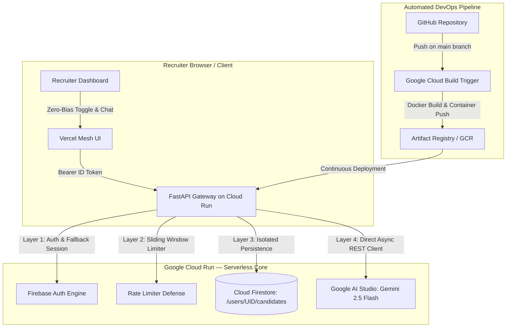

# 🚀 TalentPulse AI — Multimodal Candidate Intelligence on Google Cloud Run
> **Built for the Google Cloud Run AI Challenge (`#AccelerateAIwithCloudRun`)**  
> *Production-Ready AI Recruiting Copilot powered by Google Cloud Run, Gemini 2.5 Flash, Cloud Firestore, and Vercel Mesh Modern UI.*

[](https://talentpulse-ai-795234618090.us-central1.run.app)
[](https://github.com/crcsportsvn-boop/talentpulse-ai-68)
[](https://aistudio.google.com)

---

## 🌟 1. Overview & Value Proposition

**TalentPulse AI** is an enterprise-grade, zero-bias candidate intelligence platform built from the ground up to solve modern recruitment challenges:

- **Multimodal Resume Ingestion:** Ingests complex multi-column PDFs, DOCX, and scanned image resumes directly via Gemini without brittle OCR regex pipelines.
- **4-Dimensional Talent Radar Matrix:** Evaluates *Hard Skills*, *Domain Experience*, *Education & Certifications*, and *Career Stability* (50-100 score).
- **Zero-Bias Blind Screening:** 1-click toggle to redact Personally Identifiable Information (PII) to ensure 100% objective hiring decisions.
- **Multi-turn Candidate Deep-Dive Copilot:** Recruiter assistant capable of analyzing project depth, comparing skills, and drafting tailored correspondence in real-time.
- **Contextual Interview Kit Generator:** Synthesizes probing technical questions with scoring criteria and ready-to-send personalized email invitations in 100% professional English.
- **5-Layer Security & Anti-Abuse Defense:** Token verification, per-IP sliding window rate limiting (6 uploads/min), and Firestore user isolation.

---

## 🏗️ 2. System Architecture



---

## ⚡ 3. Quickstart & Local Setup

### Prerequisites
- Python 3.11+
- Google AI Studio API Key ([Get one here](https://aistudio.google.com/app/apikey))

### 1. Clone & Setup Virtual Environment
```bash
git clone https://github.com/crcsportsvn-boop/talentpulse-ai-68.git
cd talentpulse-ai-68
python -m venv .venv

# On Windows:
.\.venv\Scripts\activate
# On Linux/macOS:
source .venv/bin/activate

pip install -r requirements.txt
```

### 2. Configure Environment Variables
Copy `.env.example` to `.env` and set your active credentials:
```bash
cp .env.example .env
```

### 3. Run Locally
```bash
uvicorn backend.main:app --reload --port 8080
```
Visit `http://localhost:8080` to experience the dashboard!

---

## 🚀 4. Google Cloud Run Deployment

### Option A: 100% Automated CI/CD (Cloud Build)
1. In Google Cloud Console, navigate to **Cloud Run** $\rightarrow$ `talentpulse-ai`.
2. Connect Continuous Deployment to `crcsportsvn-boop/talentpulse-ai-68` on branch `^main$`.
3. Any `git push origin main` will automatically build and deploy within 60 seconds!

### Option B: Direct CLI Deployment
```bash
gcloud run deploy talentpulse-ai \
  --source . \
  --project gen-lang-client-0394973299 \
  --region us-central1 \
  --platform managed \
  --allow-unauthenticated \
  --max-instances 2 \
  --min-instances 0 \
  --cpu-throttling \
  --memory 1Gi
```

---

## 🛡️ 5. Key Highlights for Contest Judges
1. **Google Cloud Native:** Serverless Cloud Run ($0 idle cost via scale-to-zero), Artifact Registry, Cloud Build CI/CD.
2. **Gemini 2.5 Flash Integration:** Fast multimodal reasoning, strict JSON validation, multi-turn chat grounding.
3. **Enterprise UI/UX:** Vercel Mesh design system, true obsidian palette, fluid radar visualization, non-intrusive toast notifications.

---

## 📄 License
Licensed under the Apache 2.0 License.
