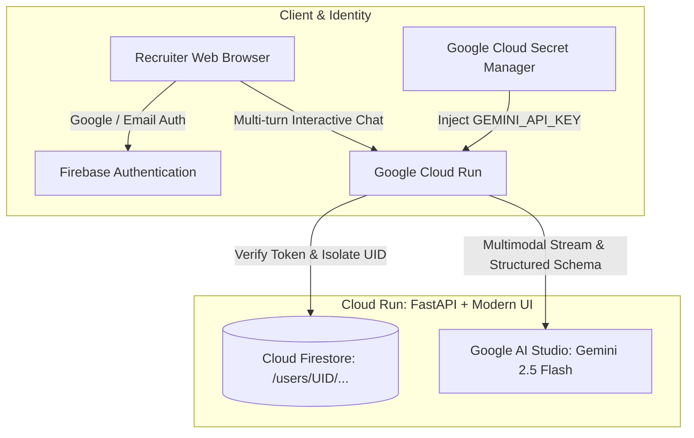

# 🚀 TalentPulse AI — Multimodal Candidate Screening & Multi-turn Recruiter Copilot
> **Built for the Google Cloud Run AI Challenge (`#AccelerateAIwithCloudRun`)**  
> *Production-ready AI Recruiting Copilot powered by Google Cloud Run, Firebase Authentication, Cloud Firestore, and Gemini API.*

[](https://cloud.google.com/run)
[](https://aistudio.google.com)
[](https://firebase.google.com)
[](https://firebase.google.com/docs/firestore)
[](https://cloud.google.com/secret-manager)

---

## 🌟 1. Overview & Value Proposition

**TalentPulse AI** is an intelligent, zero-bias candidate screening platform designed to solve the biggest bottlenecks in modern talent acquisition:

- **Multimodal Resume Parsing:** Parses complex multi-column PDFs, DOCX, and scanned image resumes directly with Gemini without brittle OCR regex pipelines.
- **4-Dimensional Talent Radar Scoring:** Evaluates Hard Skills, Domain Experience, Education & Certifications, and Career Stability.
- **Zero-Bias Blind Screening Mode:** 1-click toggle to redact Personally Identifiable Information (PII) to eliminate unconscious hiring bias.
- **Multi-turn Candidate Deep-Dive Copilot:** Allows recruiters to conduct multi-turn interactive Q&A grounded in the candidate's exact CV context.
- **Automated Interview Kit Generator:** Synthesizes probing technical questions with good-answer indicators and ready-to-send personalized email invitations.

---

## 🏗️ 2. System Architecture



---

## ⚡ 3. Quickstart & Local Development

### Prerequisites
- Python 3.11+
- Google AI Studio API Key ([Get one here](https://aistudio.google.com/app/apikey))
- (Optional) Firebase Project for production authentication

### 1. Clone & Setup Virtual Environment
```bash
git clone https://github.com/your-org/talentpulse-ai.git
cd talentpulse-ai
python -m venv .venv
# On Windows:
.venv\Scripts\activate
# On Linux/macOS:
source .venv/bin/activate
pip install -r requirements.txt
```

### 2. Configure Environment Variables
Copy `.env.example` to `.env` and fill in your keys:
```bash
cp .env.example .env
```

### 3. Run Locally
```bash
uvicorn backend.main:app --reload --port 8080
```
Open your browser at `http://localhost:8080` to experience the dashboard!

---

## 🚀 4. Deployment to Google Cloud Run

### One-Command Deployment with `gcloud`:
```bash
# 1. Authenticate with Google Cloud
gcloud auth login
gcloud config set project YOUR_GCP_PROJECT_ID

# 2. Store API Key in Secret Manager
echo -n "YOUR_GEMINI_API_KEY" | gcloud secrets create GEMINI_API_KEY --data-file=-

# 3. Deploy to Cloud Run
gcloud run deploy talentpulse-ai \
  --source . \
  --region us-central1 \
  --allow-unauthenticated \
  --set-secrets GEMINI_API_KEY=GEMINI_API_KEY:latest
```

---

## 📄 License
This project is licensed under the Apache 2.0 License.
